# Ajax Jokes Project

## Description

The Ajax Jokes Project is a web-based project designed as a starter project to learn about Axios, async/await, and other related functionalities. The project's main functionality is to retrieve a random joke from a website using AJAX (Asynchronous JavaScript and XML) requests and display it on a webpage in the browser.

## Features

- **Random Joke Retrieval**: The project uses AJAX requests to fetch a random joke from a specified website.
- **Display in Browser**: Once the joke is retrieved, it is displayed on a webpage in the user's browser.
- **Async/Await**: Asynchronous operations are handled using `async` and `await` keywords, ensuring smooth and non-blocking execution of code.
- **Axios Integration**: Axios, a promise-based HTTP client, is utilized for making AJAX requests to the joke website's API.

---

# Personal Website

## Description

The Personal Website project is a static HTML and CSS webpage designed to serve as a personal portfolio or introduction. It was created as an opportunity to learn how to style web elements manually and gain a better understanding of front-end web development techniques.

## Features

- **Static Webpage**: The website is a static webpage built using HTML and CSS, making it lightweight and easy to host.
- **Introduction**: The webpage provides information about the owner, serving as a personal portfolio or introduction.
- **Custom Styling**: All styling is done manually using CSS, allowing for customization and learning opportunities.
- **Responsive Design**: The webpage is designed to be responsive, ensuring compatibility with various devices and screen sizes.

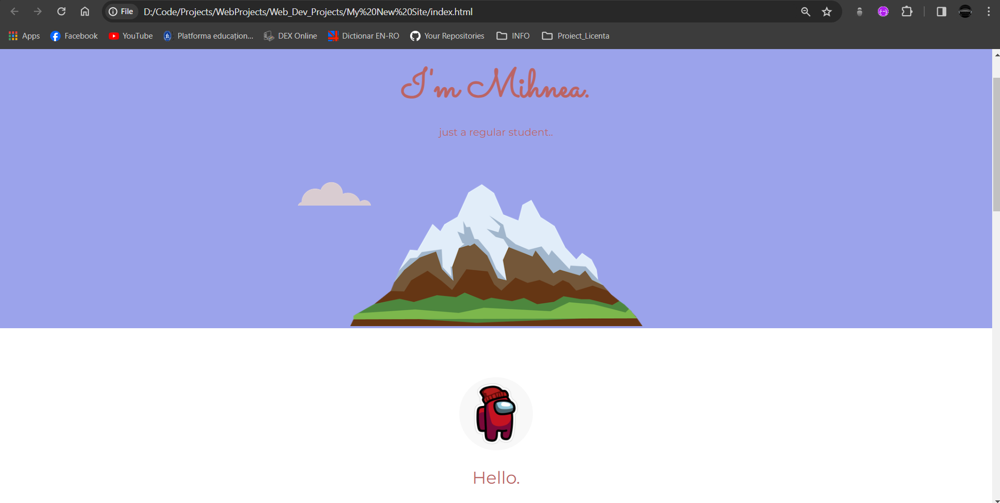

# Museum of Candy

## Description

The Museum of Candy project is a static webpage built using HTML, CSS, and Bootstrap. It serves as a virtual museum showcasing various types of candy. The project was created as an opportunity to learn about styling web pages and making them more responsive using Bootstrap, a popular front-end framework.

## Features

- **Static Webpage**: The website is a static webpage, making it easy to host and access.
- **Bootstrap Integration**: Bootstrap is used for styling and layout, providing a responsive design that adapts to different screen sizes and devices.
- **Candy Showcase**: The webpage showcases various types of candy, providing images and descriptions for each.
- **Responsive Design**: The use of Bootstrap ensures that the webpage is responsive and looks great on desktops, tablets, and mobile devices.

## 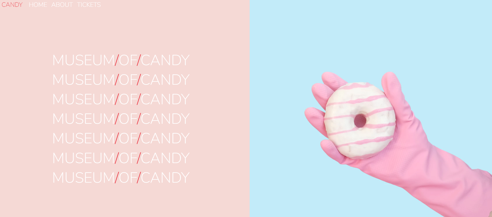

# Score Keeper

## Description

The Score Keeper project is a simple web-based application built using HTML, CSS, and JavaScript. Its main functionality is to help keep track of scores between two players during a game. The project was created as a practical exercise to learn about DOM manipulation and event handling in JavaScript.

## Features

- **Dynamic Scorekeeping**: The application allows users to increment the scores of two players during a game.
- **Reset Functionality**: Users can reset the scores of both players to zero with the click of a button.
- **Simple and Intuitive Interface**: The user interface is designed to be simple and intuitive, making it easy for users to keep track of scores during a game.

## 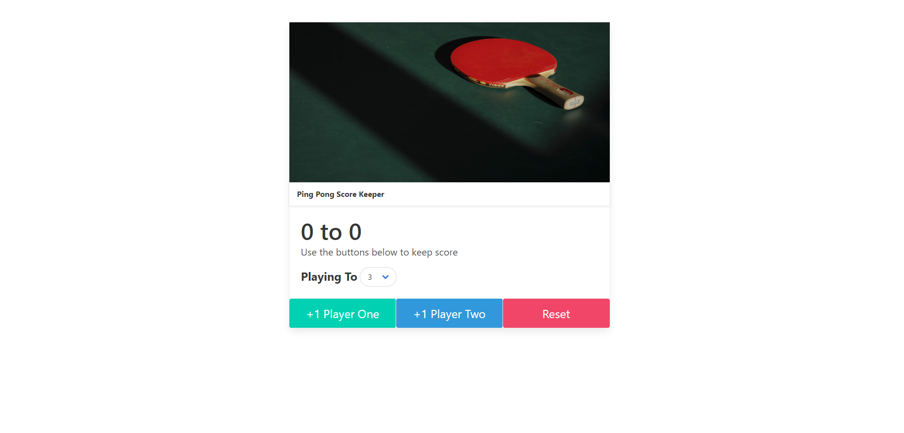

# Google Keeper React

## Description

The Google Keeper React project is a web-based application built using React.js. It serves as a note-taking application where users can create, manage, and organize their private notes. The project was created as a practical exercise to learn about building dynamic and interactive user interfaces using React.js.

## Features

- **Note Creation**: Users can create new notes with titles and content.
- **Note Management**: Notes can be edited, deleted, and rearranged.
- **Dynamic Interface**: The user interface is built using React components, providing a seamless and responsive experience.
- **State Management**: React's state management capabilities are leveraged to handle the application's data flow and interactions.
- **LocalStorage Integration**: Notes are stored locally in the browser's localStorage, ensuring privacy and persistence across sessions.

## 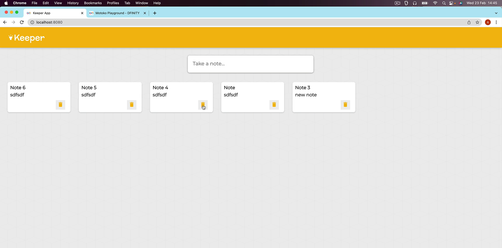

# YELP

## Description

The Campground Finder project is a web application inspired by Yelp, designed to help users find campgrounds all around the world. The main page features a large map with pinpoint markers for each registered campground. Users can explore, review, and comment on campgrounds, creating a vibrant community-driven platform for outdoor enthusiasts. Images are stored and served using Cloudinary, ensuring seamless integration and performance.

## Features

- **Interactive Map**: The main page displays an interactive map with pinpoint markers for each registered campground, providing users with a visual overview of available options.
- **Campground Listings**: Users can explore detailed listings for each campground, including information such as location, amenities, and user reviews.
- **Review and Comment System**: Users can leave reviews and comments on campground pages, sharing their experiences and recommendations with others.
- **Cloudinary Integration**: Images associated with campgrounds are stored and served using Cloudinary, ensuring fast loading times and efficient image management.
- **User Authentication**: Registered users can create accounts, log in, and access additional features such as posting reviews and comments.

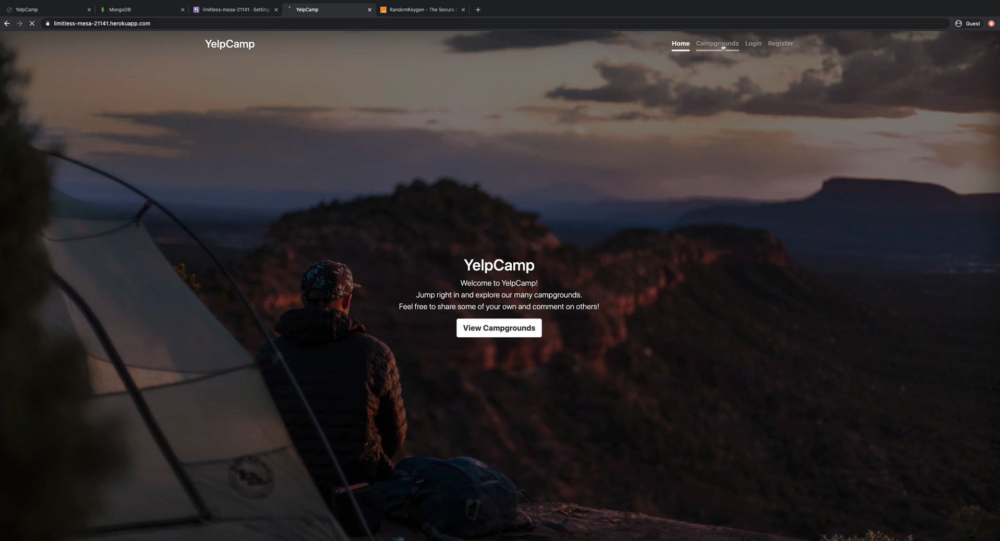
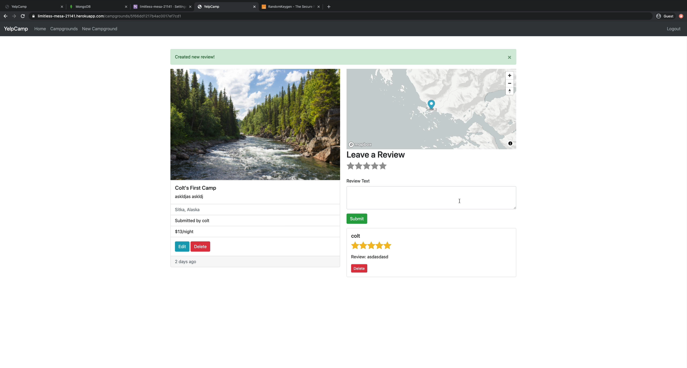
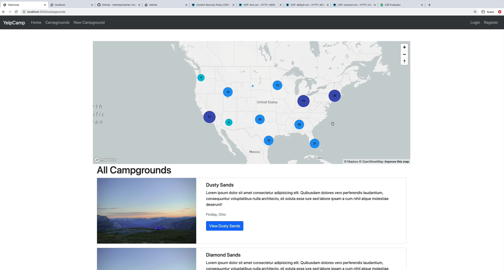

---

# Internet Computer Projects

# dbank

## Description

The dbank project is a simulator implemented in Motoko programming language. It simulates a bank account system where users can receive or send credits. It serves as a learning exercise for understanding basic account management functionalities.

## Features

- **Account Management**: Users can create accounts, deposit credits, withdraw credits, and check their balance.
- **Transaction Simulation**: Transactions between accounts are simulated within the system.
- **Simple Interface**: The interface is designed to be simple and easy to use, focusing on basic account operations.

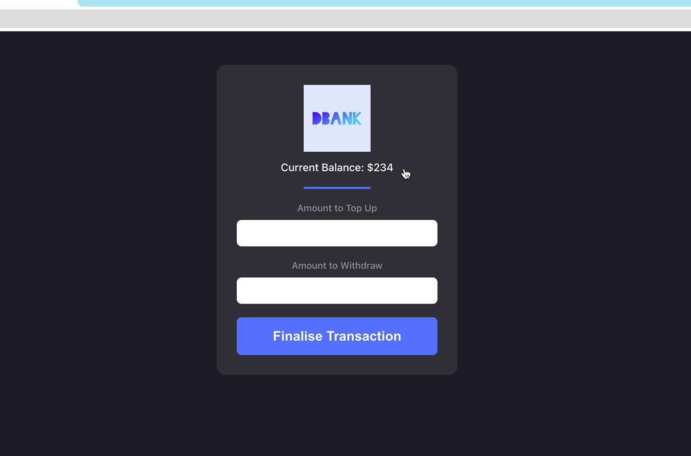

# dkeeper

## Description

The dkeeper project is similar to the keeper project from previous projects, but this time the data is stored on the blockchain using Motoko programming language. It serves as an exercise for building decentralized applications (dApps) and understanding blockchain-based data storage.

## Features

- **Decentralized Data Storage**: Notes are stored on the blockchain, ensuring data integrity and immutability.
- **Note Management**: Users can create, edit, delete, and organize their notes directly on the blockchain.
- **Blockchain Integration**: The project leverages the features of the Internet Computer blockchain for data storage and transaction processing.
- **Secure and Trustless**: Since the data is stored on the blockchain, it is secure and resistant to tampering or unauthorized access.

---

# token

## Description

The token project is a "faucet" type website implemented in Motoko programming language. It uses a custom crypto token and allows users to create transactions from one account to another. It serves as a demonstration of token creation and transaction functionalities on the Internet Computer blockchain.

## Features

- **Custom Crypto Token**: The project introduces a custom crypto token implemented using Motoko.
- **Transaction Creation**: Users can request transactions from a faucet-like interface, transferring tokens from one account to another.
- **Blockchain Integration**: The token transactions are executed on the Internet Computer blockchain, ensuring security and trustlessness.
- **Faucet-like Functionality**: Users can request tokens from the faucet to fund their accounts for testing and experimentation purposes.

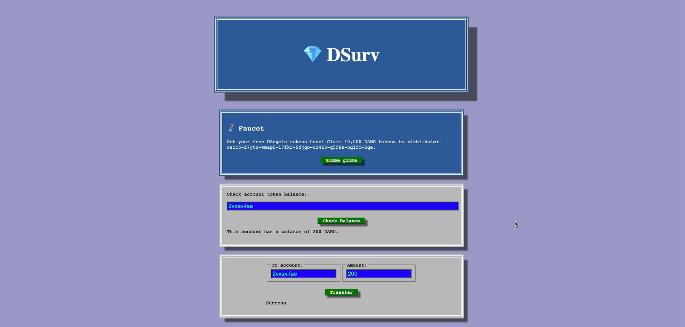

# opend

## Description

The opend project is an OpenSea-like application implemented in Motoko programming language. It revolves around NFTs (Non-Fungible Tokens) and allows users to discover, browse, and buy NFTs on the Internet Computer blockchain. It serves as a showcase of decentralized marketplace functionalities.

## Features

- **NFT Discovery**: Users can explore and discover NFTs listed on the marketplace.
- **Browse and Buy**: Users can browse through NFT listings, view detailed information about each NFT, and purchase NFTs using tokens.
- **Blockchain Integration**: The project integrates with the Internet Computer blockchain for NFT storage, transactions, and marketplace functionalities.
- **Decentralized Marketplace**: The marketplace operates in a decentralized manner, ensuring trustless transactions and data integrity.

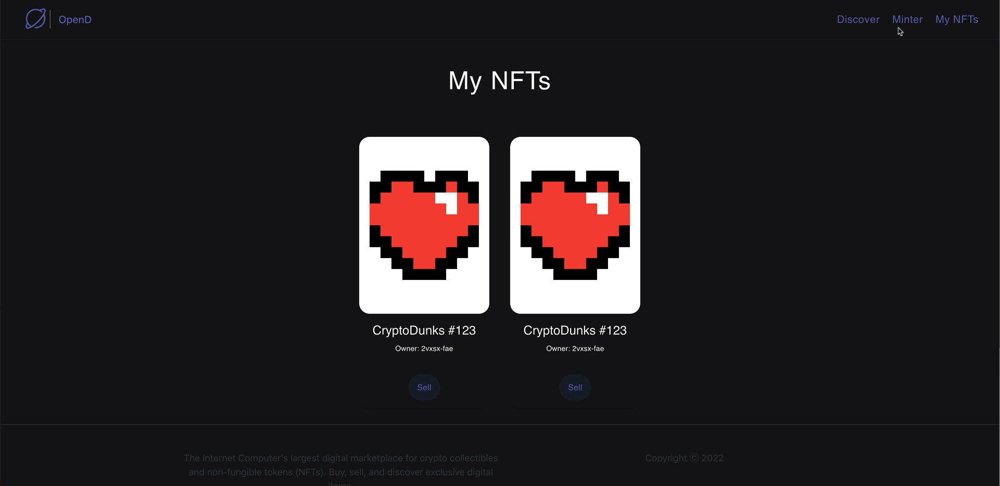
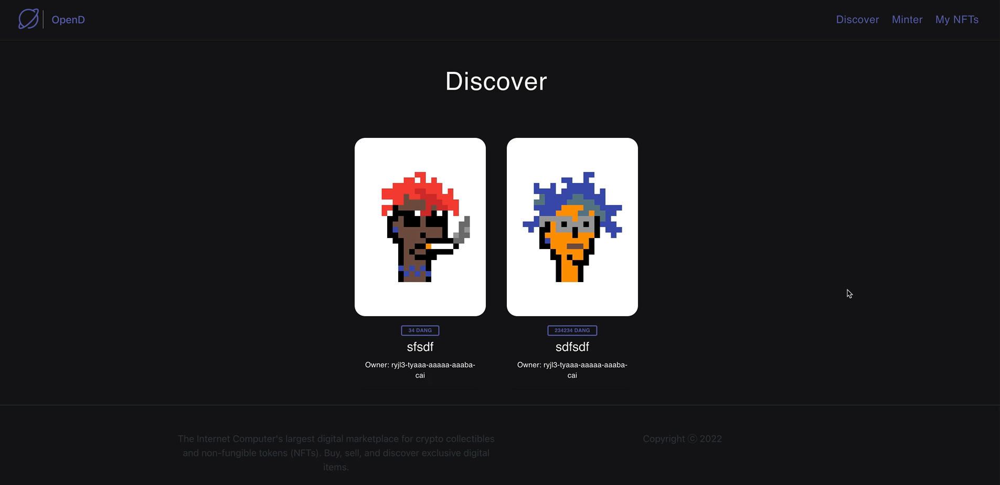

---
